# Creating-AWS-resources
creating AWS resources with functions and introducing Arrays

i will be creating two functions which will streamline the process of resources creation (EC2 instances and S3 buckets) and enabling automation of tasks effectively

# STEP 1
setting up the amazon CLI on the ec2 instance 
* set up an EC2 instance
* generate a key pair
* connect to the EC2 instance 
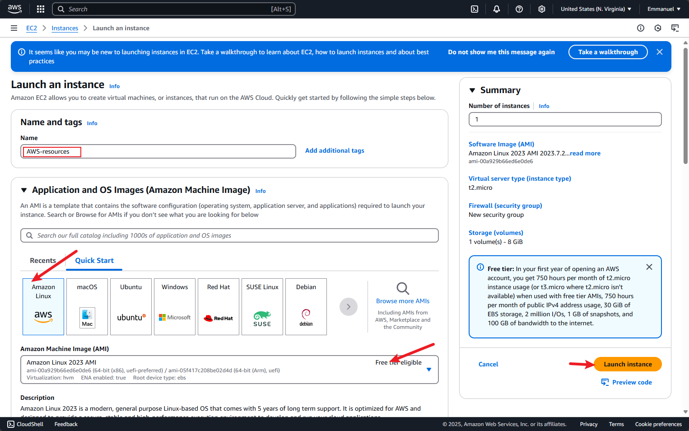
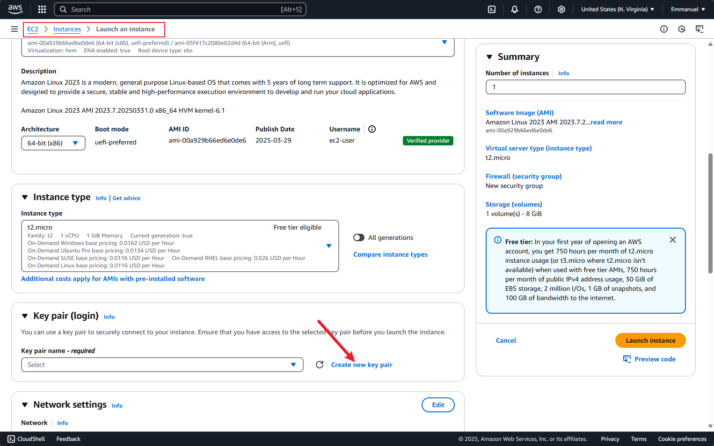
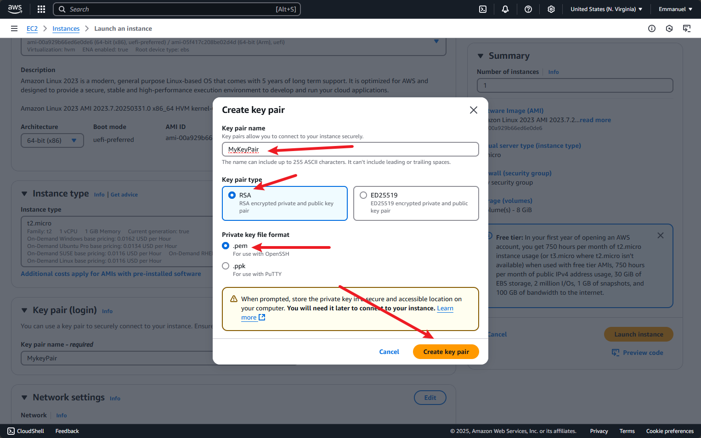
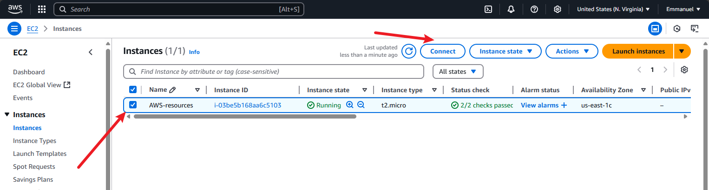
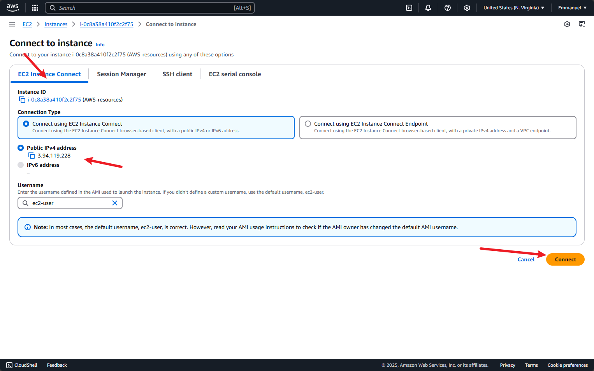

* Install the AWS CLI on the instance *
after successfully connecting the EC2 instance the next step is to make sure AWS CLI is set up properly
 to install the latest version of the AWS CLI,it is necessary to uninstall the pre-installed yum version using the following command "sudo yum remove awscli" to
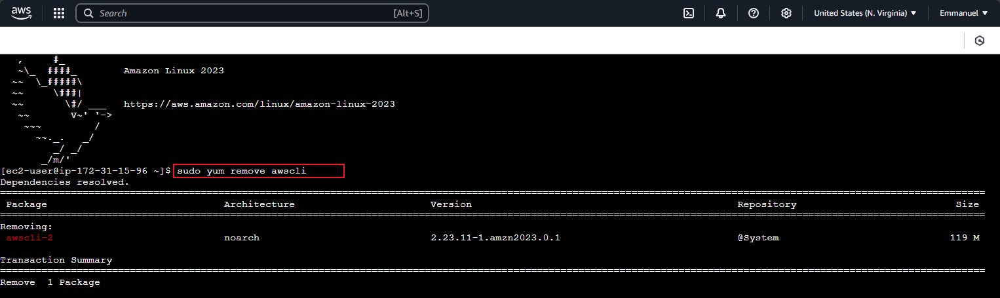
*To install the AWS CLI, run the following commands "curl "https://awscli.amazonaws.com/awscli-exe-linux-x86_64.zip" -o "awscliv2.zip"
unzip awscliv2.zip
sudo ./aws/install
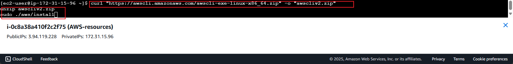
* To update your current installation of the AWS CLI the command is used "curl "https://awscli.amazonaws.com/awscli-exe-linux-x86_64.zip" -o "awscliv2.zip"
unzip awscliv2.zip
sudo ./aws/install --bin-dir /usr/local/bin --install-dir /usr/local/aws-cli --update
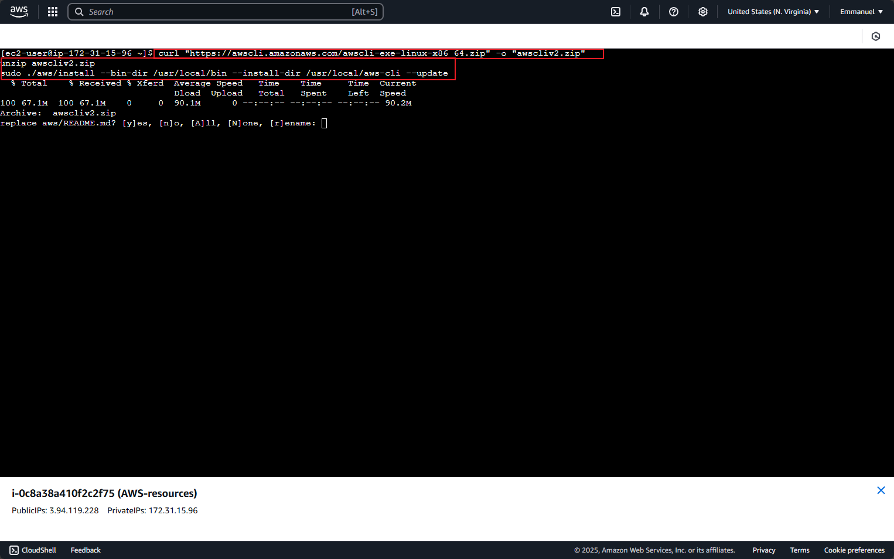
* download and unzip the installer file  using the commands:for download "curl "https://awscli.amazonaws.com/awscli-exe-linux-x86_64.zip" -o "awscliv2.zip"" and to unzip "unzip awscliv2".zip
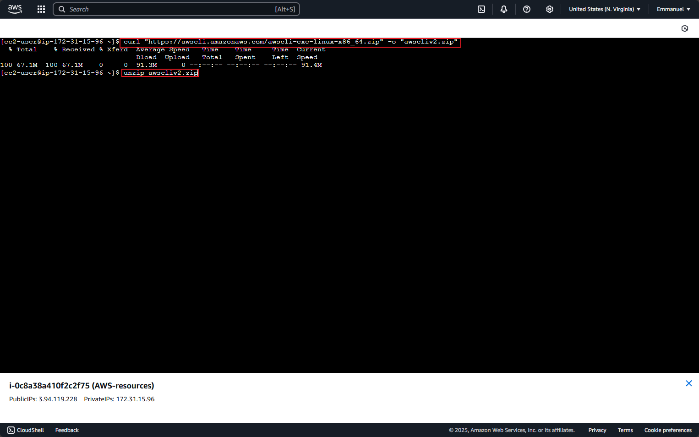
* Run the install program "sudo ./aws/install""
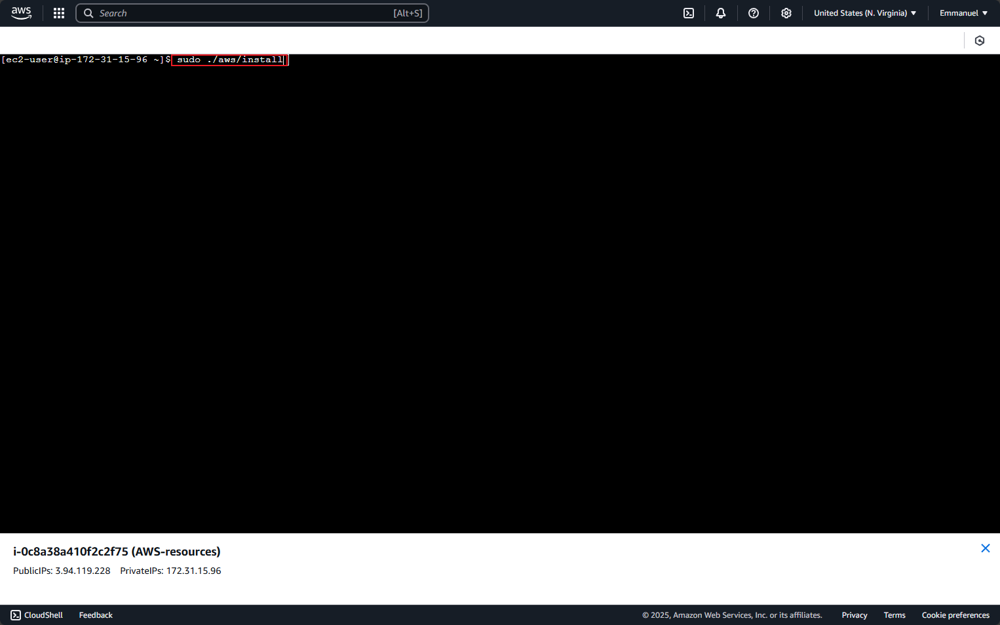
* rm the installation with the following command "aws --version"
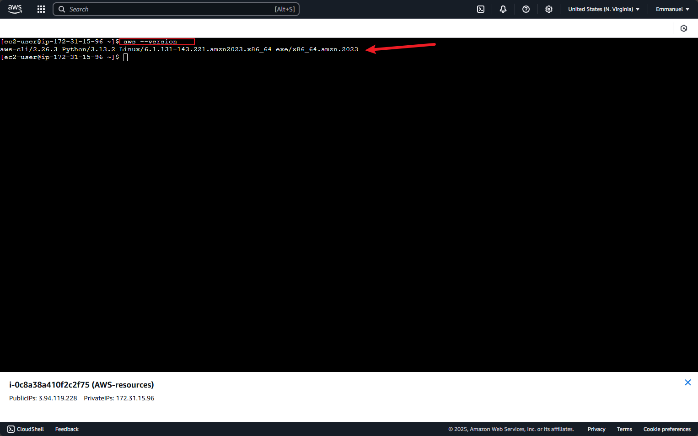

# STEP 2: 
Creating a shell script for provisioning EC2 instance on AWS 
* create a folder "create_aws_resources.sh" using the command "nano" and make the folder exececutable using "chmod +x"
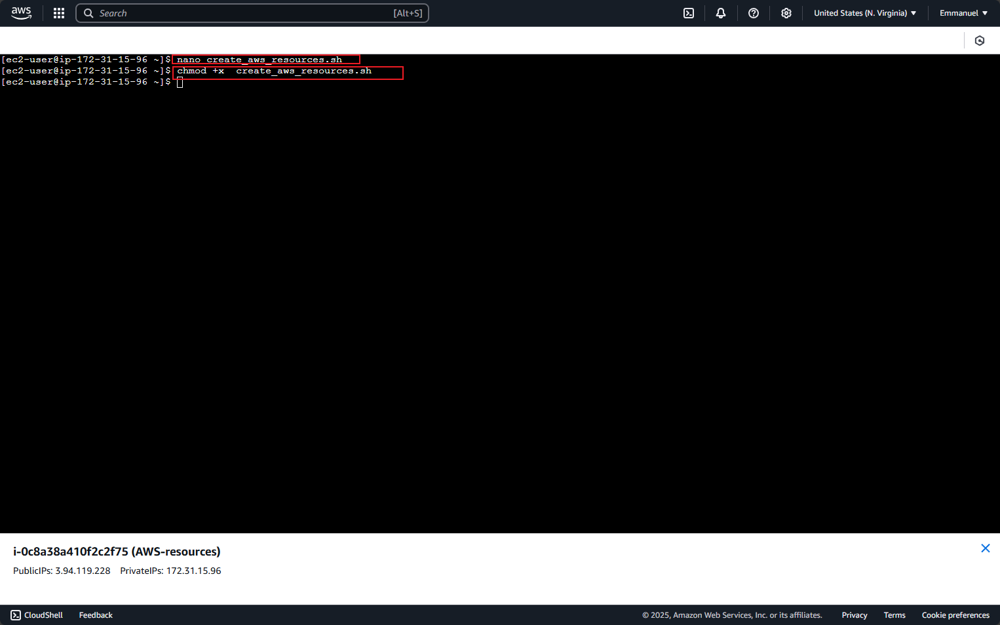

# STEP 3:  
* writing the shell script :
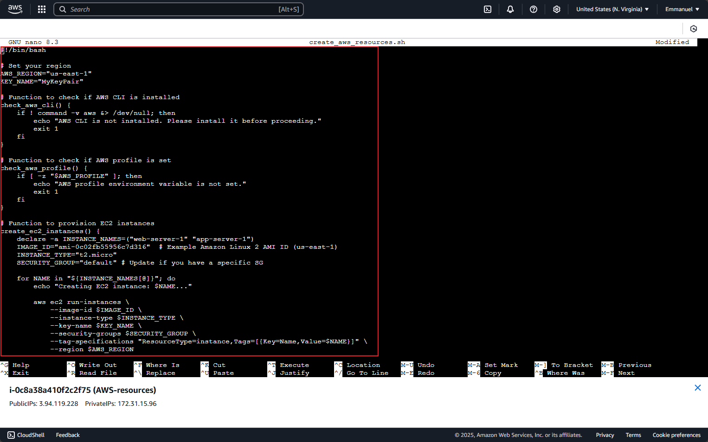

setting  the preffered region as us east 1 and using the key created earlier "MyKeyPair" 
     
    #!/bin/bash

    # Set your region
    AWS_REGION="us-east-1"
    KEY_NAME="MyKeyPair"

    # Function to check if AWS CLI is installed
    check_aws_cli() {
    if ! command -v aws &> /dev/null; then
        echo "AWS CLI is not installed. Please install it before proceeding."
        exit 1
    fi
    }

    # Function to set AWS profile
    check_aws_profile() {
    if [ -z "$AWS_PROFILE" ]; then
        if aws configure list-profiles | grep -q default; then
            export AWS_PROFILE="default"
            echo "ℹ️ AWS_PROFILE not set. Defaulting to: $AWS_PROFILE"
        else
            echo "❌ No AWS profile found. Please run 'aws configure' first."
            exit 1
        fi
    else
        echo "✅ AWS_PROFILE is set to: $AWS_PROFILE"
    fi
    }

    # Function to provision EC2 instances
    create_ec2_instances() {
    SUBNET_ID="subnet-08ae79d5430ce513a"  # Replaced with actual subnet ID

    aws ec2 run-instances \
        --image-id $IMAGE_ID \
        --instance-type $INSTANCE_TYPE \
        --key-name $KEY_NAME \
        --security-group-ids $SECURITY_GROUP \
        --subnet-id $SUBNET_ID \
        --tag-specifications "ResourceType=instance,Tags=[{Key=Name,Value=$NAME}]" \
        --region $AWS_REGION
     
     } 
      # <--- You were missing this closing brace

    # Function to create S3 buckets
    create_s3_buckets() {
    declare -a BUCKET_NAMES=("my-project-logs-$(date +%s)" "my-project-data-$(date +%s)")

    for BUCKET in "${BUCKET_NAMES[@]}"; do
        echo "Creating S3 bucket: $BUCKET..."
        if [ "$AWS_REGION" == "us-east-1" ]; then
            aws s3api create-bucket \
                --bucket "$BUCKET" \
                --region "$AWS_REGION"
        else
            aws s3api create-bucket \
                --bucket "$BUCKET" \
                --region "$AWS_REGION" \
                --create-bucket-configuration LocationConstraint=$AWS_REGION
        fi
    done
    }

    # Main execution
    check_aws_cli
    check_aws_profile
    create_ec2_instances
    create_s3_buckets

* running the script to see the output using the command "./"

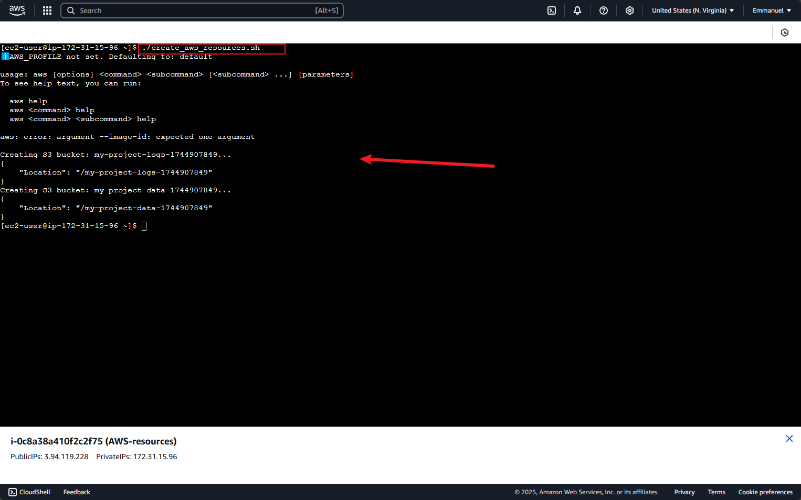